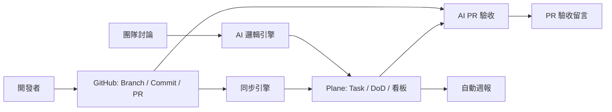
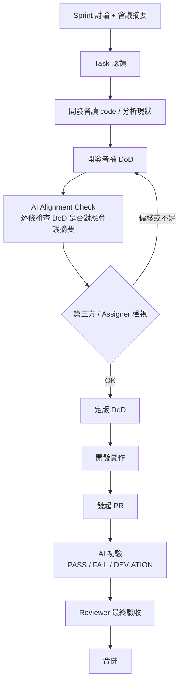

# NeuralPlane

AI 驅動的 Scrum 管理架構 — 讓 DoD 從口號變成可自動驗收的流程。

## 問題

團隊開發時常見的痛點：

| 痛點 | 頻率 | 原因 |
|:----|:----:|:----|
| PR 合併後才發現不符合需求 | 每次 code review | DoD 有名無實，reviewer 不知原本要求什麼 |
| 看板狀態落後 | 每天 | 手動更新，開 PR 後忘記改狀態 |
| Sprint 規劃沒有標準格式 | 每週 | 討論完就開工，沒有結構化驗收標準 |
| 週報人工整理 | 每 Sprint | 散落各處的資料需手動彙整 |

## 解決方案

NeuralPlane 連接 **Plane**（可視化看板）、**GitHub**（程式碼與 PR）、**AI**（驗收引擎），建立一條從 Sprint 討論到 PR 驗收的自動化鏈條。



## 核心流程：DoD 治理

本專案最關鍵的設計不是技術架構，而是 **DoD 的生命週期治理**。

### 流程總覽



### DoD 何時寫、誰寫、怎麼防漂移

| 問題 | 答案 |
|:----|:----|
| **何時寫？** | 開發者讀完 code 確認 scope 後、動手實作之前 |
| **誰寫？** | Task 認領者（最知道要做什麼的人） |
| **怎麼防漂移？** | 雙重校驗：① AI 比對會議摘要 ② 第三方/Assigner 檢視 |
| **Reviewer 怎麼驗？** | 不只是 PASS/FAIL，加入 **DEVIATION** 選項，接受合理偏離 |

### DoD 品質規則

| 不良範例 | 問題 | 通過標準 |
|---------|------|---------|
| 「實作登入 API」 | 太模糊 | 「密碼使用 bcrypt、JWT 過期 24h、含整合測試」 |
| 「處理錯誤」 | 無法驗證 | 「輸入錯誤密碼 5 次鎖定 15 分鐘」 |
| 「寫好寫滿」 | 無法證偽 | 每條必須可用測試或觀察來 PASS/FAIL |

---

## 技術架構

### 模組邊界

| 模組 | 責任 | 輸入 | 輸出 |
|:----|:----|:----|:----|
| **Planning Parser** | 將討論拆成任務 | 討論摘要 / Sprint 目標 | Task 草稿、DoD 清單 |
| **Plane Connector** | 建立/更新 Issue | Task 草稿、DoD | Plane Issue ID、狀態 |
| **GitHub Connector** | 接收 PR/Commit 事件 | GitHub webhook/API | 事件路由 |
| **Sync Engine** | PR ↔ Plane 狀態對應 | PR 狀態、Plane Issue | Plane 狀態更新 |
| **AI Validation Agent** | 對照 DoD 驗收 PR | PR diff、Task DoD | PR 留言 + 驗收摘要 |
| **Reporting Aggregator** | 彙整 Sprint 指標 | Plane/GitHub 資料 | 週報 JSON/Markdown |

### 工具選擇

| 模組 | 工具 | 原因 |
|:----|:----|:----|
| 可視化中樞 | **Plane**（開源） | Epic/Cycle/Task 管理、看板、燃盡圖 |
| 執行實體 | **GitHub** | 程式碼、PR、CI/CD |
| AI 引擎 | **LLM via OpenCode MCP** | 彈性切換模型、無 vendor lock |
| 連接器 | **Webhook + Plane API** | 即時狀態同步 |

---

## 導入策略

不照技術難度排，而是照 **團隊最快感受到價值** 的順序。

### 🟢 短期（1-2 週）— AI PR 驗收留言

**先不急著部署 Plane。**

直接在 GitHub 流程加一道 AI 門檻：
- GitHub Action 偵測 PR opened
- AI 讀取 PR description 中的 `[DoD]` 區塊
- AI 比對 PR diff，逐條留言 PASS / FAIL / UNKNOWN

**唯一需要的規範**：PR description 要包含 `[DoD]`。
**退出成本**：關掉 Action 就好。

### 🟡 中期（2-4 週）— GitHub ↔ Plane 雙向同步

- 部署 Plane（Docker 30 分鐘）
- 建立 PR body `Plane-Issue: <key>` 規範
- PR opened → Plane 自動 Review
- PR merged → Plane 自動 Done

**不再手動更新看板。**

### 🔵 長期（1-2 個月）— AI Sprint 規劃 + 自動週報

- 討論摘要自動轉成 Plane Tasks + DoD
- 自動產出週報（完成率、PR 合併數、DoD 通過率）
- 逐步收斂 DoD 品質

---

## 開發狀態

| Phase | 內容 | 狀態 |
|:----|:----|:----:|
| Phase 0 | Plane/GitHub API 可行性確認 | ✅ 完成 |
| Phase 1 | AI Task + DoD 生成 | 🟡 Conditional GO |
| Phase 2 | PR 狀態同步 Plane | 🟢 GO |
| Phase 3 | AI PR DoD 驗收留言 | 🟡 Conditional GO |
| Phase 4 | Reporting | 📋 規劃 |
| Phase 5 | E2E Pilot | 📋 規劃 |

### 當前 Blockers（需 User 提供）

- Plane API token（`X-API-Key`）
- Plane workspace slug & project ID
- GitHub webhook endpoint URL（可用 ngrok）

---

## 專案結構

```
NeuralPlane/
├── intro.md                          # MVP 原始需求
├── README.md                         # 本文件
├── AGENTS.md                         # OpenCode Agent 操作指引
├── docs/agent_context/
│   ├── neuralplane_mvp/              # 總體規劃
│   │   └── task_plan.md
│   └── neuralplane_phase0/           # Phase 0 spike 文件
│       ├── task_plan.md
│       ├── developer_prompt.md
│       ├── development_log.md
│       ├── api_capability_matrix.md
│       ├── event_samples.md
│       ├── linking_strategy.md
│       └── phase0_spike_report.md
└── .opencode/                        # OpenCode runtime 設定
    ├── setup.sh
    ├── mcp.sh
    └── opencode.json.template
```

---

## 參考文件

- [Plane Self-hosted Architecture](https://developers.plane.so/self-hosting/plane-architecture)
- [Plane API Reference](https://developers.plane.so/api-reference/introduction)
- [GitHub Webhook Events](https://docs.github.com/en/webhooks/webhook-events-and-payloads)
- [GitHub Webhook Best Practices](https://docs.github.com/en/webhooks/using-webhooks/best-practices-for-using-webhooks)
